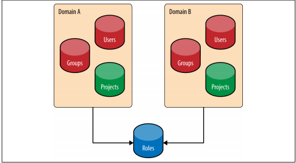
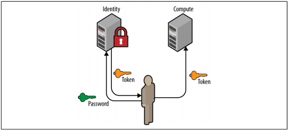
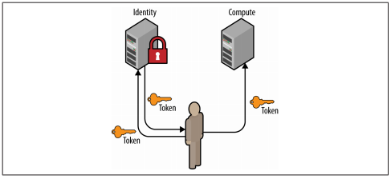
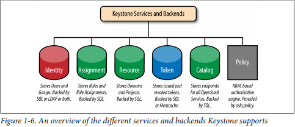
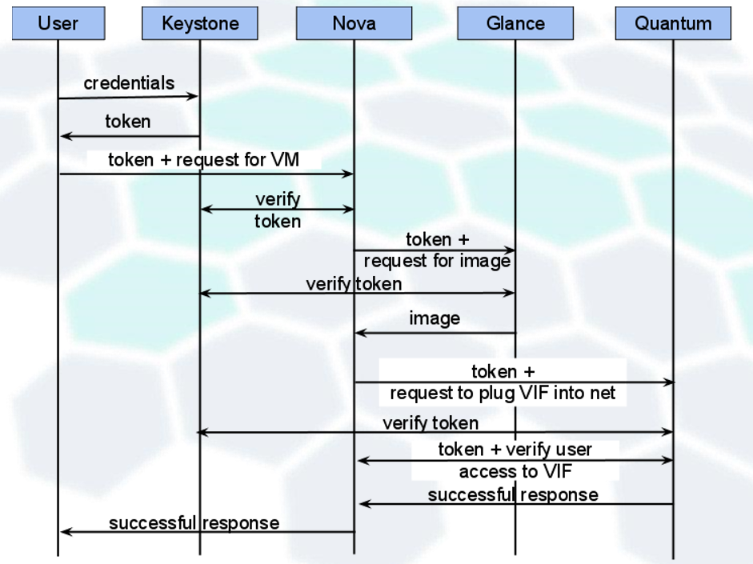
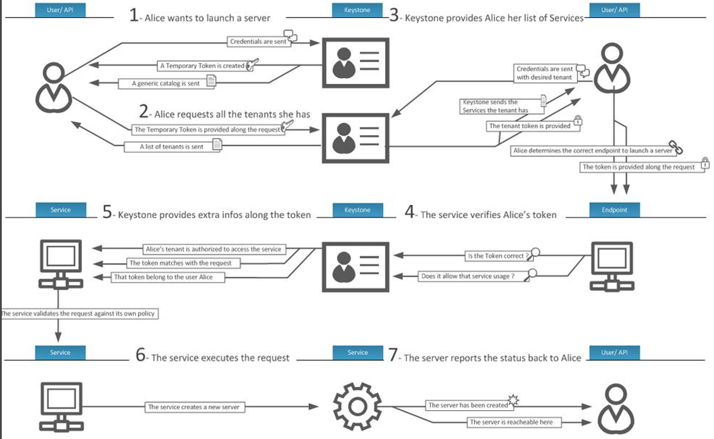

# Tìm hiểu tổng quan về keystone
---
## Giới thiệu tổng quan về chức năng và lợi ích khi sử dụng keystone

Môi trường cloud theo mô hình dịch vụ Infrastructure-as-a-Service layer (IaaS) cung cấp cho người dùng khả năng truy cập vào các tài nguyên quan trọng ví dụ như máy ảo, kho lưu trữ và kết nối mạng. Bảo mật vẫn luôn là vấn đề quan trọng đối với mọi môi trường cloud. Trong OpenStack, keystone có trách nhiệm đảm nhận việc bảo mật, kiểm soát truy cập tới tất cả các tài nguyên của cloud. Nó sẽ chịu trách nhiệm cung cấp các kết nối mang bảo mật cao tới các tài nguyên OPS.

### Ba chức năng chính của keystone
1. Định danh (Identity):
- Nhận diện những người đang cố truy cập vào các tài nguyên cloud
- Trong keystone, identity thường được hiểu là định danh User

> Tại những mô hình OpenStack nhỏ, identity của user thường được lưu trữ trong database của keystone. Đối với những mô hình lớn cho doanh nghiệp thì 1 external Identity Provider thường được sử dụng.

2. Xác thực (Authentication)
- Là quá trình xác thực, nhận dạng user (user's identity)
- Keystone có tính pluggable tức là nó có thể liên kết với những dịch vụ xác thực người dùng khác như LDAP hoặc Active Directory.
- Thường thì keystone sử dụng Password cho việc xác thực người dùng. Sau đó, keystone sử dụng token thay vì mật khẩu.
- OpenStack dựa rất nhiều vào tokens để xác thực và keystone chính là dịch vụ duy nhất có thể tạo ra token.
- Token có giới hạn về thời gian được phép sử dụng. Khi token hết hạn thì user sẽ được cấp một token mới. Cơ chế này làm giảm nguy cơ user bị đánh cắp token.
- Hiện tại, keystone đang sử dụng cơ chế bearer token. Có nghĩa là bất cứ ai có token thì sẽ có khả năng truy cập vào tài nguyên của cloud. Vì vậy việc giữ bí mật token rất quan trọng.

3. Quản lý truy cập (Authorization)
- Access Management hay còn được gọi là Authorization là quá trình xác định những tài nguyên mà user được phép truy cập tới.
- Trong OpenStack, keystone kết nối users với những Projects hoặc Domains bằng cách gán role cho user vào những project hoặc domain ấy.
- Các project trong OpenStack như Nova, Cinder...sẽ kiểm tra mối quan hệ giữa role và các user's project và xác định giá trị của những thông tin này theo cơ chế các quy định (policy engine). Policy engine sẽ tự động kiểm tra các thông tin (thường là role) và xác định xem user được phép thực hiện những gì.

### Lợi ích của KeyStone
- Cung cấp giao diện xác thực và quản lí truy cập cho các services của OpenStack. Nó cũng đồng thời chịu trách nhiệm cho toàn bộ công việc giao tiếp và làm việc với các hệ thống xác thực bên ngoài.
- Cung cấp danh sách đăng kí các container ("Projects") mà nhờ vậy các services khác của OpenStack có thể dùng nó để "tách" tài nguyên (servers, images,...)
- Cung cấp danh sách đăng kí các Domain được dùng để định nghĩa các khu vực riêng biệt cho users, groups, và projects khiến các khách hàng trở nên "tách biệt" với nhau.
- Danh sách đăng kí các Role được keystone dùng để ủy quyền cho các services của OpenStack thông qua file policy.
- Assignment store cho phép users và groups được gán các roles trong projects và domains.
- Catalog lưu trữ các services của OpenStack, endpoints và regions, cho phép người dùng tìm kiếm các endpoints của services mà họ cần.

## Các khái niệm trong Keystone
### Project

Nội dung:
- Khái niệm Project sử dụng để nhóm và cô lập các nguồn tài nguyên sử dụng cho dịch vụ.
- Project tập hợp 1 nhóm tài nguyên, chỉ 1 số user chỉ định mới có thể truy cập, tách biệt hoàn toàn với các project khác.
- Ban đầu project được gọi là tenant sau đó được đổi tên thành project.
- Mục đích cơ bản của keystone là tạo project, xác định user được quyền truy cập project.
- Việc gán role cho user đôi khi còn được gọi là "grant" trong Openstack Document.

### Domain
Ban đầu không có cơ chế hạn chế sự xuất hiện của các project (Tạo project tùy ý). Điều này có thể gây nhầm lẫn hay xung đột không đáng có giữa các tên của project của các tổ chức. Tên user cũng có thể dẫn tới sự nhầm lẫn nếu hai tổ chức có user có tên giống nhau.

Vì vậy, xuất hiện khái niệm domain, nó dùng để cô lập project và user của 2 tổ chức khác nhau.

Mỗi domain là tập hợp các user, group, project. Nó cho phép người dùng phân chia tài nguyên rõ ràng, tránh xung đột.

### User, User Groups (Actor)
Trong keystone, User và User Group là các đối tượng được cấp phép truy cập tới các nguồn tài nguyên đã cô lập trong các domain và các project.

> Group tập hợp các user. User và User Group được gọi là các `Actor`.

> Mối quan hệ giữa domain, project, user, và group:

### Role
Roles thể hiện quyền cấp phép trong keystone. Một actor có thể có nhiều role đối với từng project khác nhau.

### Assignment
- Role assignment là sự kết hợp của actor, target và role.
- Role assignment có thể cấp phát, thu hồi, và kế thừa giữa các user, group, project và domain.\

### Target
- Project và Domain đều có thể gán role. Từ đó sinh ra khái niệm target.

### Token
- Để user truy cập các OpenStack API, user đó cần được xác thực khi sử dụng API. Để làm được điều này, user cần có token và gán chúng vào "API call".
> Keystone chính là service chịu trách nhiệm tạo ra các token.

- Sau khi được xác thực thành công bởi keystone, user sẽ nhận được token từ keystone. Token chứa các thông tin ủy quyền của user trên cloud.
- Token chứa 2 phần:
 - ID đảm bảo rằng nó là duy nhất trên mỗi cloud
 - payload chứa thông tin của user.

### Catalog
- Chứa các URL, endpoint của các services khác nhau.
- Nếu không có Catalog, user và các ứng dụng sẽ không thể xác định nơi gửi yêu cầu dịch vụ.
- Service Catalog được chia nhỏ thành danh sách các endpoint.
> Mỗi endpoint chứa admin URL, internal URL, và public URL.

## Identity
Identity service trong keystone cung cấp các Actor. Nó có thể các dịch vụ khác nhau như SQL, LDAP, và Federated Identity Providers.

### SQL
- Tùy chọn lưu trữ các actor trong SQL. Hỗ trợ các database như MySQL, PostgreSQL, và DB2.
- Keystone sẽ lưu các thông tin như tên, mật khẩu và mô tả.
- Thiết lập các database nằm trong file config của keystone.
- Về bản chất, Keystone sẽ hoạt động như 1 Identity Provider (Cung cấp dịch vụ chứng thực).

Ưu điểm:
- Dễ thiết lập
- Quản lí user, group thông qua các OpenStack API.

Nhược điểm:
- Keystone không nên là một Identity Provider
- Hỗ trợ mật khẩu yếu
- Phải ghi nhớ username và password.

### LDAP
- Tùy chọn lưu trữ các actor trong LDAP.
- Keystone sẽ truy cập LDAP như các ứng dụng khác (System Login, Email, Web Application, etc.).
- Thiết lập kết nối sẽ được lưu trong file config của keystone. Các cài đặt bao gồm tùy chọn cho phép keystone được ghi hoặc chỉ đọc dữ liệu từ LDAP.
- Thông thường LDAP chỉ cho phép các câu lệnh đọc (ví dụ như tìm kiếm user, group và xác thực).
 - Nếu sử dụng LDAP như một read-only Identity Backends thì Keystone cần có quyền sử dụng LDAP.

Ưu điểm:
-  Không cần sao lưu tài khoản người dùng.
- Keystone không hoạt động như một Identity Provider.

Nhược điểm:
- Tài khoản các dịch vụ lưu không tập trung.
- Keystone có thể thấy mật khẩu người dùng trong quá trình chứng thực.

### Multiple Backends
- Kể từ bản Juno, Keystone hỗ trợ nhiều Identity backend cho V3 Identity API. Vì vậy mà mỗi một domain có thể có một identity source (backend) khác nhau.
- Domain mặc định thường sử dụng SQL backend bởi nó được dùng để lưu các host service accounts. Service accounts là các tài khoản được dùng bởi các dịch vụ OpenStack khác nhau để tương tác với Keystone.
- Việc sử dụng Multiple Backends được lấy cảm hứng trong các môi trường doanh nghiệp, LDAP chỉ được sử dụng để lưu thông tin của các nhân viên bởi LDAP admin có thể không ở cùng một công ty với nhóm triển khai OpenStack. Bên cạnh đó, nhiều LDAP cũng có thể được sử dụng trong trường hợp công ty có nhiều phòng ban.

Ưu điểm:
- Cho phép việc sử dụng nhiều LDAP để lưu tài khoản người dùng và SQL để lưu tài khoản dịch vụ
- Sử dụng lại LDAP đã có.

Nhược điểm:
- Thiết lập phức tạp
- Xác thực tài khoản người dùng phải trong miền scoped

### Provider
- Từ bản Icehouse, Keystone đã có thể sử dụng các liên kết xác thực thông qua module Apache cho các Identity Providers khác nhau.
- Cơ bản, Keystone sẽ sử dụng một bên thứ 3 để xác thực, nó có thể là những phần mềm sử dụng các backends (LDAP, AD, MongoDB) hoặc mạng xã hội (Google, Facebook, Twitter).

Ưu điểm:
- Tận dụng phần mềm và cơ sở hạ tầng cũ để xác thực cũng như lấy thông tin của user.
- Tách biệt keystone và nhiệm vụ định danh, xác thực thông tin.
- Mở ra cánh cửa mới cho những khả năng mới ví dụ như single signon và hybrid cloud
- Keystone không thể xem mật khẩu, mọi thứ đều không còn liên quan tới keystone.

Nhược điểm:
- Thiết lập phức tạp

## Authentication
Có rất nhiều cách để xác thực với Keystone service, trong đó 2 phương thức được dùng nhiều nhất là password và token.

### Password

### Token

## Backends and Services
Bản tóm tắt cho các services và backends đi kèm.
- Phần màu xanh lá cây thường sử dụng SQL.
- Phần màu đỏ là backend thường sử dụng LDAP hoặc SQL
- Phần màu xanh da trời thường sử dụng SQL hoặc Memcache.
> Còn policy service sẽ được lưu dưới dạng file. Ngoài ra Keystone còn có thêm các services khác tuy nhiên đây là những services được dùng phổ biến nhất.

## Keystone Workflow.

> Luồng xác thực

> Keystone Workflow

# Nguồn

https://github.com/hocchudong/thuctap012017/blob/master/DucPX/OpenStack/Keystone/docs/Overview_Keystone.md#III

https://github.com/thaonguyenvan/meditech-thuctap/blob/master/ThaoNV/Tim%20hieu%20OpenStack/docs/keystone/Fundamental-keystone.md#catalog
