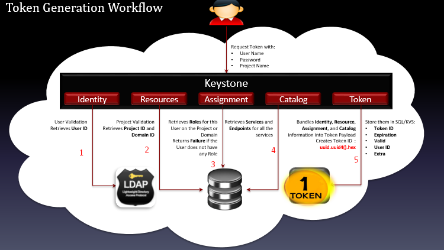
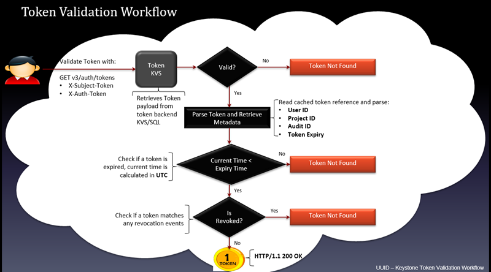
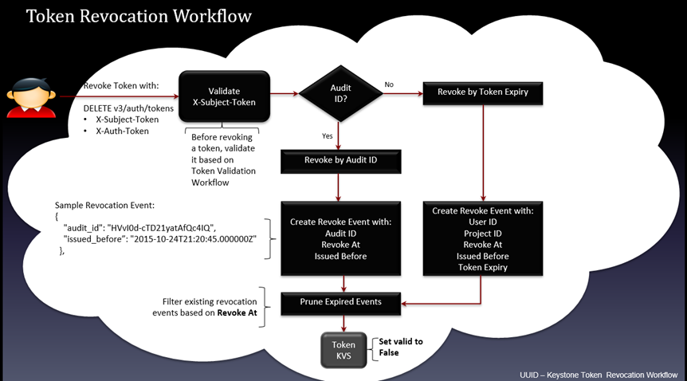
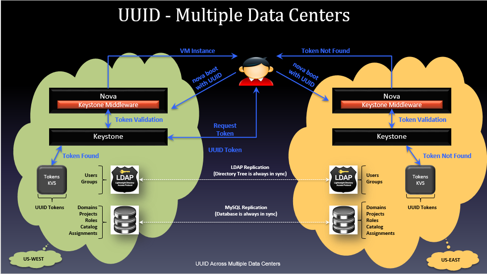
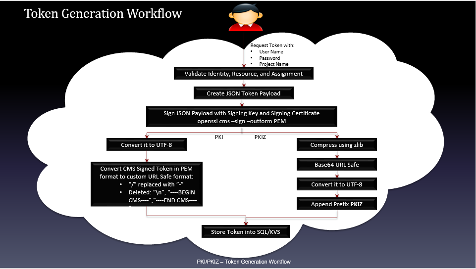
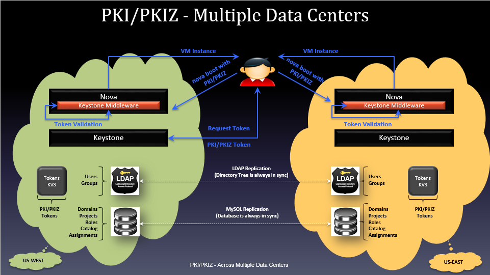
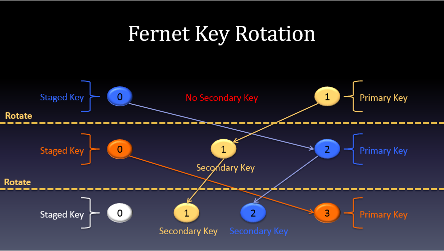

# Token format trong KeyStone
---
## Mục đích cơ bản của KeyStone:
### Định danh sử dụng API - Cho user
- Lấy Token: 
 - Token sử dụng cho truy cập Resource và Services
 - Chứa quyền User trên project
- Lấy service catalog
 - URL endpoint tới các servuce khác
- Lấy token = /v3/auth/tokens

### Định danh sử dụng API - Cho admin
- Định nghĩa
 - User, group
 - Project
 - Roles
 - Roles user trên project
 - Service, endpoint service

### Đinh danh sử dụng API - Cho service
- xác thực token
- discover các service endpoint khác

> Để làm điều đó, keystone sử dụng token.

### 4 phương pháp tạo token trong KeyStone: 
- UUID
- PKI
- PKIZ
- Fernet

## UUID (universally unique identifier):
- UUID là viết tắt của Universally Unique IDentifier, hiểu nôm na là một định danh duy nhất trong toàn thể vũ trụ (universal cơ mà) =)). Mục đích của UUID sinh ra là bởi vì:
- A UUID is a 16-octet (128-bit) number.
- UUID được đại diện bởi 32 chữ số thập lục phân,hiển thị trong năm nhóm, phân cách bằng dấu gạch nối, với dạng 8-4-4-4-12. Có tổng cộng 36 ký tự, trong đó 32 ký tự chữ với 4 dấu gạch ngang.
- UUID có 5 phiên bản, trong đó keystone sử dụng UUIDv4.

### Đặc điểm UUID trong keystone
- Có độ dài 32 byte, nhỏ, dễ sử dụng, không nén.
- Không mang theo đủ thông tin, nó chỉ đơn giản là định danh khóa chiếu đến 1 bảng trong db keystone.
- Được lưu vào database.
- Sử dụng thời gian dài làm giảm hiệu suất hoạt động, CPU tăng và thời gian đáp ứng lâu.
- Sử dụng câu lệnh keystone-manager token flush để làm tăng hiệu suất hoạt động.

### Ưu nhược điểm
Ưu điểm:
- Phương pháp tạo token đơn giản
- Khuyến cao cho mỗi trường phát triển

Nhược điểm:
- Token cố định
- Không linh hoạt khi triển khai Multi OpenStack

### UUID Token Generation Workflow 
- Bước 1: Xác nhận user, lấy UserID.
- Bước 2: Xác nhận project, lấy project id và domain id.
- Bước 3: Lấy roles cho user trên project hoặc domain đó. Trả lại kết quả Failure nếu user không có roles đó.
- Bước 4: Lấy các services và endpoitns
- Bước 5: Gộp các thông tin Identity, Resource, Assignment, Catalog vào token payload. Tạo token id bằng hàm uuid.uuid4().hex.

> Lưu giữ các thông tin Token ID, Expiration, Valid, User ID, Extra vào backend.

### UUID Token Validation Workflow 
- Bước 1: Xác nhận token bằng cách gửi một phương thức GET đến Token KVS.
- Bước 2: Token KVS sẽ kiểm tra trong backend. Kết quả trả về nếu không là Token not found, nếu có, chuyển sang bước 3.
- Bước 3: Phân tích token và lấy các metadata: UserID, Project ID, Audit ID, Token Expiry.
- Bước 4: Kiểm tra thời gian hiện tại với thời gian hết hạn của token. Nếu token hết hạn, trả về Token not found. Nếu còn hạn, chuyển sang bước 5
- Bước 5: Kiểm tra token có bị thu hồi không, nếu no, trả về cho người dùng thông điệp HTTP/1.1 200OK (token sử dụng được).

### UUID Token Revocation Workflow 
- Bước 1: Gửi một yêu cầu DELETE token. Trước khi revoke token thì phải xác nhận lại token (Token validation workflow)
- Bước 2: Kiểm tra Audit ID. Nếu không có audit ID, chuyển sang bước 3. Nếu có audit ID, chuyển sang bước 6.
- Bước 3: Token được thu hồi khi hết hạn, chuyển sang bước 4.
- Bước 4: Tạo một event revoke với các thông tin: User ID, Project ID, Revoke At, Issued Before, Token expiry. .
- Bước 5: Chuyển sang bước 9.
- Bước 6: Token được thu hồi bởi audit id.
- Bước 7: Tạo event revoke với các thông tin: audit id và thời điểm revoke trước khi hết hạn.
- Bước 8: Lọc các event revoke đang tồn tại dựa trên Revoke At.
- Bước 9: Set giá trị false vào token avs của token.

### UUID - Multiple Data Centers
UUID Token không hỗ trợ xác thực và ủy quyền trong trường hợp multiple data centers. Như ví dụ mô tả ở hình vẽ, một hệ thống cloud triển khai trên hai datacenter ở hai nơi khác nhau. Khi xác thực với keystone trên datacenter US-West và sử dụng token trả về để request tạo một máy ảo với Nova, yêu cầu hoàn toàn hợp lệ và khởi tạo máy ảo thành công. Trong khi nếu mang token đó sang datacenter US-East yêu cầu tạo máy ảo thì sẽ không được xác nhận do token trong backend database US-West không có bản sao bên US-East.

## PKI - PKIZ:
### PKI
- Sử dụng phương pháp khóa công khai, đòi hỏi 3 loại key (key.pem, cert.pem, ca.pem)
- Chứa nhiều thông tin: thời điểm khởi tạo, thời điểm hết hạn, user id, project, domain, role gán cho user, danh mục dịch vụ nằm trong payload.
- Xác thực trực tiếp bằng token, không cần phải gửi yêu cầu xác thực đến Keystone.
- Có bộ nhớ cache, sử dụng cho đến khi hết hạn hoặc bị thu hồi => truy vấn đến keystone ít hơn.
- Kích thước lớn, chuyển token qua HTTP, sử dụng base64.
- Kích thước lớn chủ yếu do chứa thông tin service catalog.
- Tuy nhiên, Header của HTTP chỉ giới hạn 8kb. Web server không thể xử lý nếu không cấu hình lại, khó khăn hơn UUID
- Để khắc phục lỗi trên thì phải tăng kích thước header HTTP của web server, tuy nhiên đây không phải là giải pháp cuối cùng hoặc swift có thể thiết lập không cần catalog service.
- Lưu token vào database.

### PKIZ
- Tương tự PKI.
- Khắc phục nhược điểm của PKI, token sẽ được nén lại để có thể truyền qua HTTP. Tuy nhiên, token dạng này vẫn có kích thước lớn.

### Ưu nhược điểm
Ưu điểm:
- Xác thực không cần gọi về KeyStone, token mang thông tin về user

Nhược điểm:
- Request rất nặng
- Cấu hình phức tạp
- Không linh hoạt trong hạ tầng lớn, không thực sự linh hoạt trong môi trường multi openstack

### Token Generation Workflow
Tiến trình tạo ra PKI token:
- Người dùng gửi yêu cầu tạo token với các thông tin: User Name, Password, Project Name
- Keystone sẽ chứng thực các thông tin về Identity, Resource và Asssignment (định danh, tài nguyên, assignment)
- Tạo token payload định dạng JSON
- "Ký" lên JSON payload với Signing Key và Signing Certificate , sau đó được đóng gói lại dưới định dang CMS (cryptographic message syntax - cú pháp thông điệp mật mã)
- Bước tiếp theo, nếu muốn đóng gói token định dạng PKI thì convert payload sang UTF-8, convert token sang một URL định dạng an toàn. Nếu muốn token đóng gói dưới định dang - PKIz, thì phải nén token sử dụng zlib, tiến hành mã hóa base64 token tạo ra URL an toàn, convert sang UTF-8 và chèn thêm tiếp đầu ngữ "PKIZ"
- Lưu thông tin token vào Backend (SQL/KVS)

### Token PKI/PKIZ Validation Workflow 
Tương tự UUID, chỉ khác ở chỗ là:
- Trước khi gửi yêu cầu GET đến Token KVS thì pki token sẽ được hash với thuật toán đã cấu hình trước.

### PKI/PKIZ - Multiple Data Centers
Cùng kịch bản tương tự như mutiple data centers với uuid, tuy nhiên khi yêu cầu keystone cấp một pki token và sử dụng key đó để thực hiện yêu cầu tạo máy ảo thì trên cả 2 data center US-West và US-East, keystone middle cấu hình trên nova đều xác thực và ủy quyền thành công, tạo ra máy ảo theo đúng yêu cầu. Điều này trông có vẻ như PKI/PKiZ token hỗ trợ multiple data centers, nhưng thực tế thì các backend database ở hai datacenter phải có quá trình đồng bộ hoặc tạo bản sao các PKI/PKIZ token thì mới thực hiện xác thực và ủy quyền được.

## Token Fernet
### Tổng quan
- Sử dụng mã hóa đối xưng (Sử dụng chung key để mã hóa và giải mã).
- Có kích thước khoảng 255 byte, không nén, lớn hơn UUID và nhỏ hơn PKI.
- Chứa các thông tin cần thiết như userid, projectid, domainid, methods, expiresat,....Không chứa serivce catalog.
- Không lưu token vào database.
- Cần phải gửi lại keystone để xác nhận, tương tự UUID.
- Cần phải phân phối khóa cho các khu vực khác nhau trong OpenStack.
- Sử dụng cơ chế xoay khóa để tăng tính bảo mật.
- Nhanh hơn 85% so với UUID và 89% so với PKI.

### Fernet key
- Fernet Keys lưu trữ trong /etc/keystone/fernet-keys:
 - Mã hóa với Primary Fernet Key
 - Giải mã với danh sách các Fernet Key
- Có ba loại file key:
 - Loại 1 - Primary Key sử dụng cho cả 2 mục đích mã hóa và giải mã fernet tokens. Các key được đặt tên theo số nguyên bắt đầu từ 0. Trong đó Primary Key có chỉ số cao nhất.
 - Loại 2 - Secondary Key chỉ dùng để giải mã. -> Lowest Index < Secondary Key Index < Highest Index
 - Stagged Key - tương tự như secondary key trong trường hợp nó sử dụng để giải mã token. Tuy nhiên nó sẽ trở thành Primary Key trong lần luân chuyển khóa tiếp theo. Stagged Key có chỉ số 0.

### Ưu nhược điểm
Ưu điểm:
- Nhẹ hơn PKI và PKIZ
- Không cần lưu trữ trong DB
- Trong token mang thông tin
- Hỗ trợ Multi OpenStack
Nhược điểm:
- Quá trình xác thực tăng hoạt động thu hồi

### Fernet Key rotation

# Nguồn

https://github.com/vietstacker/texbook-openstack-VN/blob/master/01.Keystone/01.Gioithieu-keystone.md#uuid

https://www.openstack.org/videos/tokio-2015/deep-dive-into-keystone-tokens-and-lessons-learned

https://github.com/hocchudong/thuctap012017/blob/master/XuanSon/OpenStack/Keystone/docs/Token%20Formats.md#2